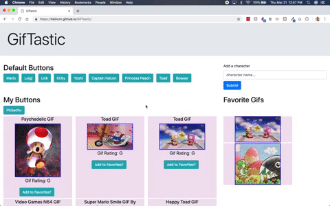

# GifTastic

## Motivation for build
This project was built to showcase my knowledge of jquery, ajax, APIs, and local storage as part of the Georgia Tech Coding Bootcamp.

### Using the website
 Clicking on any of the default buttons will generate 10 gifs associated with that character. 

Users can use the input area to generate their own buttons to click and generate gifs. 

#### About the gifs
The gifs will first load as still images. When users click upon the images, the images will become animated. Click again, and the gifs will return to the still state. 

#### Adding favorites
Below each generated gif, users will see a button allowing them to add a gif to their favorite gifs. This will move the selected gif to the "favorites" section. 

These favorites will aslo be saved in local storage for users to see again upon their return to the page. 

## Acknowledgements
I'd like to thank ther Super Smash Bros. game for the motivation for a topic of gifs. 
